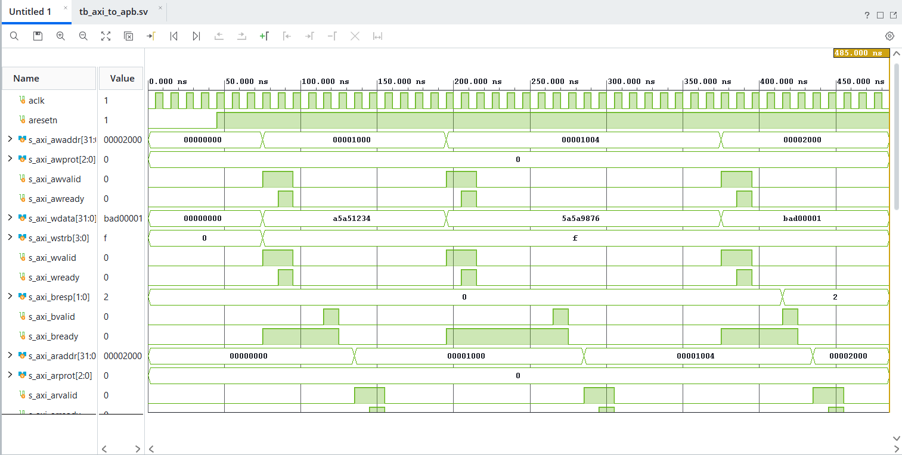
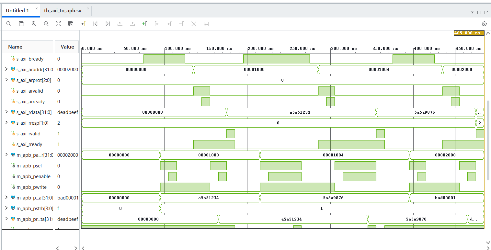
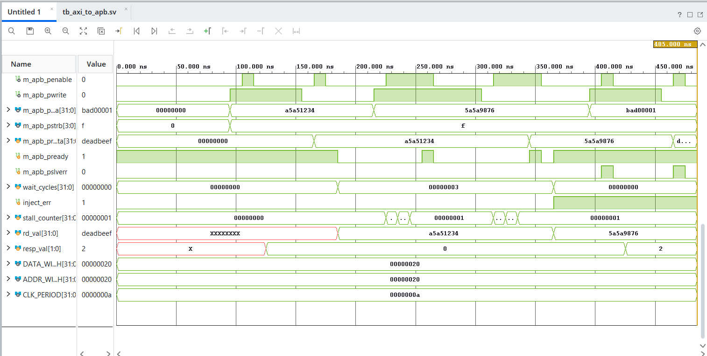
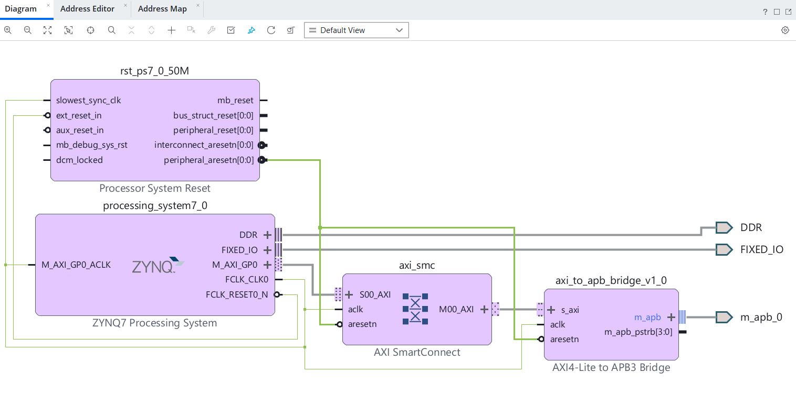

# AXI4-Lite to APB Protocol Bridge

A synthesizable, parameterized Verilog bridge that converts the five-channel AXI4-Lite slave interface into a single APB master interface. Verified in simulation with a self-checking SystemVerilog testbench (APB slave model with configurable wait states and error injection, plus protocol assertions), synthesized in Vivado for a Zynq-7000 device, and packaged as an IP block connected to the Zynq processing system in IP Integrator.

---

## Why a bridge

SoC processors and DMA engines usually talk AXI4-Lite, but simple control peripherals (UART, SPI, timers, GPIO) do not justify five independent handshake channels. APB needs far less logic. The bridge:

- accepts the independent write address (`AW`), write data (`W`), write response (`B`), read address (`AR`) and read data (`R`) channels on the AXI side
- turns each transaction into a two-phase APB transfer (`SETUP`, then `ACCESS`)
- passes the peripheral's wait states and error response back to the AXI master

```text
 AXI4-Lite master                     bridge                        APB peripheral
 (CPU / DMA)

 AW: awaddr, awprot, awvalid, awready                               paddr
 W : wdata, wstrb, wvalid, wready  ──►  axi_to_apb_bridge.v  ──►    pwdata, pstrb
 B : bresp, bvalid, bready              (5-state FSM)               pwrite, psel, penable
 AR: araddr, arprot, arvalid, arready                           ◄── prdata, pready, pslverr
 R : rdata, rresp, rvalid, rready
```

The APB side uses the APB3 handshake (`PSEL`, `PENABLE`, `PREADY`, `PSLVERR`) plus the `PSTRB` write strobes from APB4. `awprot` and `arprot` are accepted on the AXI side and ignored, and `PPROT` is not implemented.

### Parameters

| Parameter | Meaning | Default |
|-----------|---------|---------|
| `ADDR_WIDTH` | Address width on both interfaces | 32 |
| `DATA_WIDTH` | Data width on both interfaces (strobes are `DATA_WIDTH/8` bits) | 32 |

Clock is `aclk` and the active-low reset is `aresetn` (asynchronous assert).

---

## State machine

```text
                 ┌─────────────┐
    aresetn ───► │   ST_IDLE   │ ◄───────────────────────────┐
                 └──────┬──────┘                             │
   (AWVALID & WVALID)   │   or   ARVALID                     │
                        ▼                                    │
                 ┌─────────────┐                             │
                 │ ST_APB_SETUP│  drives address, data,      │
                 └──────┬──────┘  PWRITE, PSEL=1             │
                        ▼                                    │
                 ┌─────────────┐                             │
                 │ST_APB_ACCESS│  PENABLE=1, wait for PREADY │
                 └──────┬──────┘  capture PRDATA, PSLVERR    │
               ┌────────┴────────┐                           │
         write ▼                 ▼ read                      │
        ┌─────────────┐   ┌─────────────┐                    │
        │ ST_AXI_WRESP│   │ ST_AXI_RRESP│                    │
        │  BVALID = 1 │   │  RVALID = 1 │                    │
        └──────┬──────┘   └──────┬──────┘                    │
               │ BREADY          │ RREADY                    │
               └─────────────────┴───────────────────────────┘
```

| State | Behavior |
|-------|----------|
| `ST_IDLE` | Waits for a write (`AWVALID` and `WVALID` both high) or a read (`ARVALID`). A write wins if both arrive together. Latches address, data and strobes, then pulses `AWREADY`/`WREADY` or `ARREADY` |
| `ST_APB_SETUP` | Drives `PSEL`, address, data, strobes and direction with `PENABLE` low |
| `ST_APB_ACCESS` | Raises `PENABLE`. The transfer completes only when `PREADY` is high while `PENABLE` is already high on the bus, so a slave that holds `PREADY` high permanently still gets a proper access phase. Captures read data and `PSLVERR` |
| `ST_AXI_WRESP` | Holds `BVALID` with `OKAY` or `SLVERR` until `BREADY` |
| `ST_AXI_RRESP` | Holds `RVALID` with the captured data and response until `RREADY` |

### Signal mapping

| AXI4-Lite | APB | Direction | Rule |
|-----------|-----|-----------|------|
| `awaddr` / `araddr` | `paddr` | AXI to APB | Latched when the transaction is accepted |
| `wdata` | `pwdata` | AXI to APB | Latched with the write |
| `wstrb` | `pstrb` | AXI to APB | Forwarded for byte masking |
| `rdata` | `prdata` | APB to AXI | Captured on the completing `PREADY` |
| `bresp` / `rresp` | `pslverr` | APB to AXI | `0` becomes `2'b00` (OKAY), `1` becomes `2'b10` (SLVERR) |

---

## Verification

`tb/tb_axi_to_apb.sv` contains AXI master driver tasks, the bridge, and an APB slave model with a sparse memory. The slave can insert wait cycles (`wait_cycles`) and force `PSLVERR` (`inject_err`). Two concurrent SystemVerilog assertions run for the whole simulation:

- `PENABLE` must never be high without `PSEL`
- once `PSEL` and `PENABLE` are high with `PREADY` low, both must stay high on the next cycle

| Test | What it checks |
|------|----------------|
| 1. Zero wait | `PREADY` held high permanently. Write to `0x1000`, check the slave memory, then read it back and check the data |
| 2. Wait states | `PREADY` delayed 3 cycles. Same write and read-back at `0x1004` |
| 3. Error response | `PSLVERR` forced on. Write and read at `0x2000` must return `2'b10` (read data is not checked on an error) |

```text
------------------------------------------------------------
[TEST 1] Zero-Wait APB Write & Read (PREADY permanently 1)
------------------------------------------------------------
[PASS] Zero-wait write complete. Mem=0xa5a51234
[PASS] Zero-wait read complete. Read=0xa5a51234

------------------------------------------------------------
[TEST 2] Stalled APB Transfer (PREADY delayed 3 cycles)
------------------------------------------------------------
[PASS] Stalled write complete. Mem=0x5a5a9876
[PASS] Stalled read complete. Read=0x5a5a9876

------------------------------------------------------------
[TEST 3] APB Slave Error Propagation (PSLVERR -> SLVERR)
------------------------------------------------------------
[PASS] Write SLVERR correctly mapped to BRESP=2'b10
[PASS] Read SLVERR correctly mapped to RRESP=2'b10

============================================================
ALL TESTS PASSED SUCCESSFULLY
============================================================
```

### Waveforms

AXI channels over the full 485 ns run. Writes go to `0x1000`, `0x1004` and `0x2000`, and `BRESP` becomes `2` on the last one:



Read data and the APB bus. Read data returns `a5a51234` then `5a5a9876`, `RRESP` is `2` for the last read, and in the zero-wait transfers `PSEL` is high for two cycles with `PENABLE` high for one:



APB handshake. `PREADY` stays high in Test 1, drops for the 3 wait cycles when `wait_cycles` is 3, and `PSLVERR` pulses on the two accesses made while `inject_err` is high:



### Not covered yet

- Back-to-back transfers and simultaneous read and write requests
- `AW` and `W` arriving on different cycles
- `BREADY`/`RREADY` held low to stall responses
- Partial `WSTRB` values (always `4'hF`), and the slave model does not check `PSTRB`
- Reset during a transaction, randomized traffic, formal checks

---

## System integration

The bridge is packaged as a custom IP (`axi_to_apb_bridge_v1_0`) and connected to the Zynq-7000 processing system in a Vivado block design: `M_AXI_GP0` goes through an AXI SmartConnect into the bridge's `s_axi` port, `FCLK_CLK0` drives `aclk`, and a Processor System Reset block provides `aresetn`. The APB side is exported as an interface port (`m_apb_0`), and `PSTRB` appears as a separate port because it is not part of the APB3 interface definition.



No APB peripheral is attached in this design, and it has not been run on hardware.

---

## Synthesis results

Vivado 2026.1, target `xc7z010clg400-1`, 100 MHz clock (`create_clock -period 10.000`). These are post-synthesis results, so net delays are estimates. Input and output delays are not constrained (the timing check lists 140 inputs and 110 outputs without delays), so the numbers cover register-to-register paths only.

| Metric | Value | Status |
|--------|-------|--------|
| Worst negative slack (setup) | +7.247 ns | Met |
| Worst hold slack | +0.151 ns | Met |
| Worst pulse width slack | +4.500 ns | Met |
| Failing endpoints | 0 of 253 (setup and hold) | Clean |

| Resource | Available | Used | Utilization |
|----------|----------:|-----:|------------:|
| Slice LUTs | 17,600 | 54 | 0.31% |
| Slice registers | 35,200 | 181 | 0.51% |
| LUTRAM, BRAM, DSP | n/a | 0 | 0% |

Full reports are in [`reports/`](reports/).

---

## Limitations

- Single clock domain, with an asynchronous-assert reset. In the block design the reset comes from the Processor System Reset IP.
- One outstanding transaction at a time, no pipelining.
- No `PPROT`, and no timeout on a slave that never asserts `PREADY`.

## Repository layout

```text
AXI4-Lite-to-APB-Bridge/
├── rtl/
│   └── axi_to_apb_bridge.v
├── tb/
│   └── tb_axi_to_apb.sv
├── constraints/
│   └── constraints.xdc
├── reports/
│   ├── timing_summary.rpt
│   └── utilization.rpt
├── docs/
│   ├── waveform_axi_apb1.png
│   ├── waveform_axi_apb2.png
│   ├── waveform_axi_apb3.png
│   └── zynq_block_design.png
└── README.md
```

## Running it in Vivado

1. Create an RTL project for `xc7z010clg400-1`.
2. Add `rtl/axi_to_apb_bridge.v` as the design source (top) and `constraints/constraints.xdc` as constraints.
3. Add `tb/tb_axi_to_apb.sv` as a simulation source (type SystemVerilog) and set it as the simulation top.
4. Run Behavioral Simulation. The testbench ends itself with `$finish`.
5. Run Synthesis, then `report_timing_summary` and `report_utilization`.
